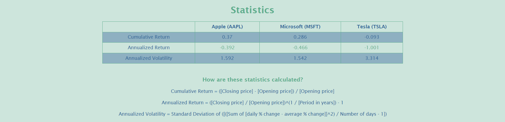

# <Stock Tracker>
 
 
 

## Description

I started this project as part of an interview, might actually continue on once graded!
This is a stock tracker, it tracks stocks using the Polygon API, I selected 3 stocks for version 1 (APPL, MSFT, TSLA).

I learned Vuejs(html / css / javascript) to develop my front end and Flask with python to develop my backend.
I also used Heroku to deploy it on a docker image.

## Table of Contents
- [Usage](#usage)
- [Next](#next)
- [Credits](#credits)

## Usage

You can check it out on: https://stock-tracker-for-alquant.herokuapp.com/
 
Run locally:
  - On the server side, first download all the required packages from the /server folder using pip:
    - pip install -r requirements.txt
  - Then do the same on the client side with npm from the /client folder:
    - npm install

  - Run Flask backend separately for development, from the /server folder:
    - flask run --port=5000 --debug
    
  - Run Vue frontend separately for development, from the /client folder:
    - npm run dev
  
Run a Docker image locally (The packages will automatically be loaded into the docker image):
  - docker build -t web:latest .
  - docker run -d --name stock-tracker-for-alquant -e "PORT=8765" -p 8007:8765 web:latest
  - docker stop stock-tracker-for-alquant
  - docker rm stock-tracker-for-alquant

## Next

Once graded, the plan is to move on with V2 version:
- Dynamically adding stocks
- Enabling period picker
- Working on the site robustness
- Building a real SQL DB to reduce API calls

## Credits

Thank you to a bunch of youtubers for getting me up to speed with front end tools,
especially @ChartJS-tutorials and @NetNinja, I might have underestimated the challenges frontend devs experience haha!
